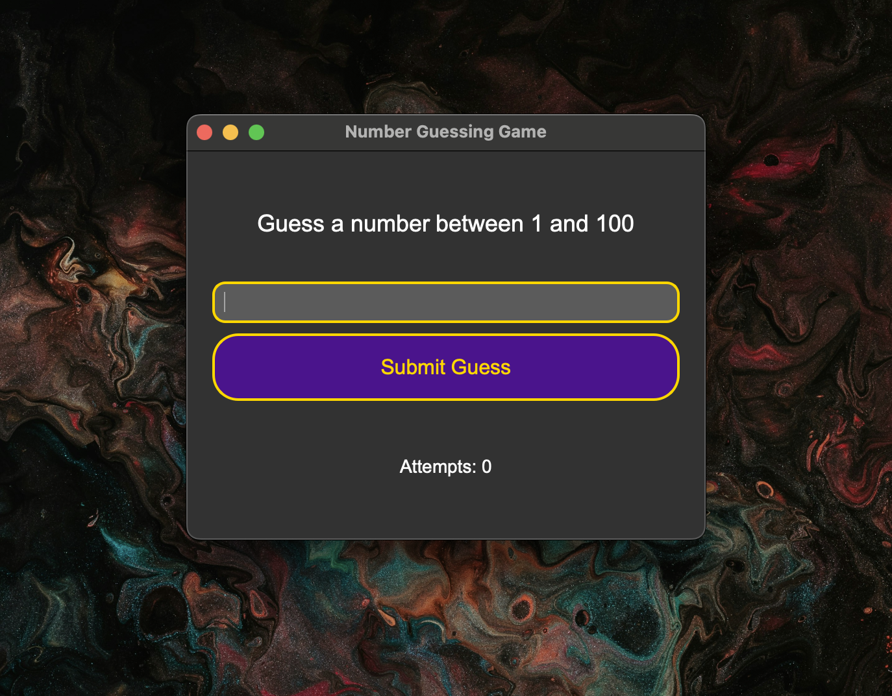
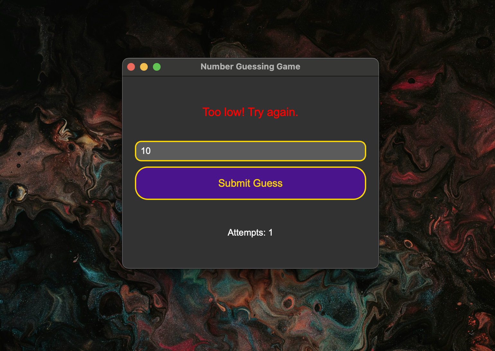
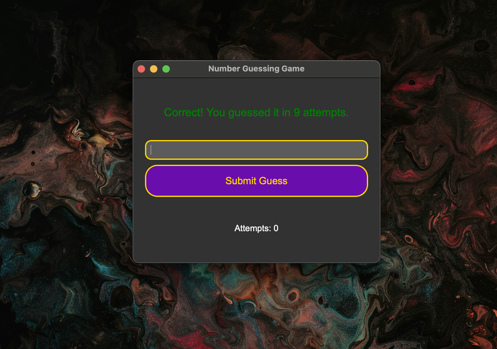

# 🎮 PyQt6 Number Guessing Game

A simple desktop number guessing game built using PyQt6, featuring a modern UI with animations, dark theme, and real-time feedback.

---

## ✨ Features

* Guess a number between 1 and 100
* Animated bounce feedback for wrong guesses
* Beautiful dark-themed UI with styled widgets
* Input validation to prevent errors
* Tracks number of attempts
* Automatic reset on correct guess

---

## 🚀 Getting Started

### Prerequisites

* Python 3.8 or higher
* PyQt6

### Installation

```bash
git clone https://github.com/RajathPatilKulkarni/Number-Guessing-Game.git
cd Number-Guessing-Game
pip install pyqt6
python NumberGuessingGame.py
```

---

## 📁 Project Structure

```
Number-Guessing-Game/
├── NumberGuessingGame.py  # Main game logic
├── README.md              # Project documentation
├── .gitignore             # Files to ignore
├── LICENSE                # MIT License
└── assets/
    ├── Start.png          # Initial state screenshot
    ├── Action.png         # Feedback on wrong guess
    └── Result.png         # Success message screenshot
```

---

## 📷 Screenshots

### Start Screen



### Wrong Guess Feedback



### Correct Guess Result



---

## 📄 License

This project is licensed under the MIT License. See the [LICENSE](LICENSE) file for details.

---

## 🔍 Topics

`python` `pyqt6` `desktop-app` `number-game` `gui` `game-dev`

